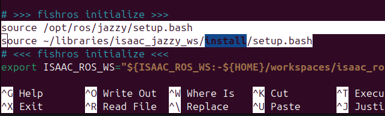
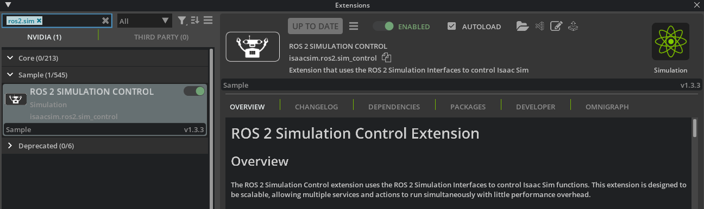

# Isaac Sim + LeRobot ROS2（通用说明）

本文档说明 `examples/IsaacSim` 下不同机器人示例共享的环境与 Isaac ROS2 配置步骤。

## 1. 环境准备

### 1.1 版本与平台

- 操作系统：`Ubuntu 24.04`
- ROS2 发行版：`Jazzy`
- Isaac Sim：`6.0`
- 已测试平台：`RTX 5060 Laptop`、`RTX 4090`

### 1.2 一键初始化（推荐）

```bash
./init.sh install-plugins
```

### 1.3 推理运行时库配置（可选）

用于避免推理阶段的 `libtiff/libjpeg` 运行时冲突：

```bash
./init.sh conda-runtime
```

## 2. 配置 Isaac Sim 的 ROS2 能力

### 2.1 启停仿真控制（Simulation State Service）

1) 按官方文档安装并配置 ROS2 工作空间：  
[Setup ROS2 Workspaces](https://docs.isaacsim.omniverse.nvidia.com/latest/installation/install_ros.html#setup-ros-2-workspaces)

2) 启用支持仿真控制的扩展：  
[Enabling Simulation Control Extension](https://docs.isaacsim.omniverse.nvidia.com/latest/ros2_tutorials/tutorial_ros2_simulation_control.html#enabling-the-extension)




3) 验证仿真状态服务：

```bash
# 启动/继续仿真（1 = playing）
ros2 service call /set_simulation_state simulation_interfaces/srv/SetSimulationState "{state: {state: 1}}"
```

```bash
# 重置仿真（0 = reset）
ros2 service call /set_simulation_state simulation_interfaces/srv/SetSimulationState "{state: {state: 0}}"
```

### 2.2 物体属性服务（Prim Service）

用于读取/修改场景内物体属性（例如位置随机化）：  
[ROS2 Prim Service](https://docs.isaacsim.omniverse.nvidia.com/latest/ros2_tutorials/tutorial_ros2_prim_service.html)

## 3. 启动仿真与 ROS2 控制（通用）

### 3.1 Isaac Sim 侧

- 按 [robot_usds](https://github.com/fiveages-sim/robot_usds) 配置机器人与场景资产。
- 打开目标机器人对应的 USD 场景并运行仿真。

### 3.2 ROS2 控制侧

- 按 [open-deploy-ws](https://github.com/fiveages-sim/open-deploy-ws) 配置 ROS2 工作空间。
- 编译对应机器人的 `description`、控制器与 topic-based ros2 control。
- 确认可通过 OCS2 arm controller 控制仿真机器人。

## 4. 机器人专有文档

- Dobot CR5：[`DobotCR5/README.md`](DobotCR5/README.md)
- Agibot G1：[`Agibot_G1/README.md`](Agibot_G1/README.md)
